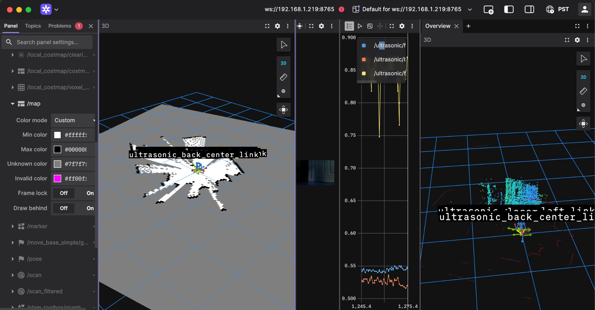
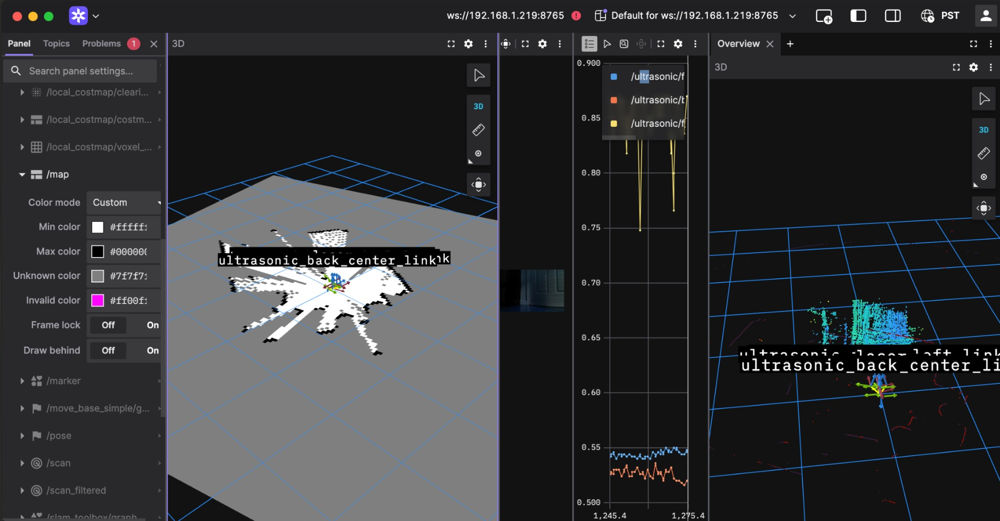

# Pet Robot - ROS2 Rover

A ROS2 Humble rover with mecanum wheels, running on Jetson with comprehensive sensor suite.

## Core Functionalities

- ROS2 Humble bringup on Jetson for full sensor + actuator stack
- Mecanum drive control with encoder feedback
- LIDAR + ultrasonic obstacle sensing and filtered scans
- OAK-D Lite RGB + depth + point cloud for navigation
- IMU integration with calibration at startup
- Foxglove bridge for live visualization over WebSocket

## Hardware

- **Compute:** Jetson (Tegra)
- **Drive:** Mecanum wheels (4WD omnidirectional)
- **Controller:** Arduino Mega 2560 running micro-ROS firmware on `/dev/ttyACM0`
- **Camera:** OAK-D Lite (DepthAI 2.28.0)
- **LIDAR:** RPLidar 360° scanner on `/dev/ttyUSB0`
- **IMU:** MPU6050 on I2C bus 7 (address `0x68`)
- **Ultrasonics:** 3x sensors (front-left, front-right, back-center)
- **Encoders:** 2x wheel encoders (left/right)

## Sensors

| Sensor | Description | Topics |
|--------|-------------|--------|
| **OAK-D Lite** | RGB + stereo depth + point cloud | `/camera/rgb/image_raw`, `/camera/points` |
| **RPLidar** | 360° laser scanner, 10Hz | `/scan`, `/scan_filtered` |
| **MPU6050 IMU** | 6-axis accelerometer + gyroscope (I2C bus 7) | `/imu/data` |
| **Ultrasonics** | 3x HC-SR04 (front-left, front-right, back-center) | `/ultrasonic/*` |
| **Wheel Encoders** | 2x quadrature encoders | `/wheel_encoders` |

## Quick Start

```bash
# Build
cd ~/rover_ws
colcon build --packages-select rover_bringup
source install/setup.bash

# Run
~/start_rover.sh
```

## Visualization

Connect with Foxglove Studio:
```
ws://<robot-ip>:8765
```

## Screenshots







## Nodes

| Node | Description |
|------|-------------|
| `micro_ros_agent` | Bridges ROS 2 DDS over USB serial to Arduino micro-ROS node |
| `oak_camera_node` | OAK-D Lite RGB, depth, and on-device neural network inference |
| `lidar_filter` | Temporal median filter with noise removal |
| `imu_node` | MPU6050 with auto-calibration at startup |

## Key Files

- `~/start_rover.sh` - launches all core ROS2 nodes
- `~/rover_ws/src/rover_bringup/rover_bringup/` - Python nodes:
  - `oak_camera_node.py` - OAK-D Lite depth + point cloud for Nav2
  - `imu_node.py` - MPU6050 with calibration
  - `lidar_filter.py` - temporal median filter (currently disabled)

## micro-ROS Drive Base

- Arduino micro-ROS firmware subscribes to `/cmd_vel` and publishes `/wheel_encoders`
- Jetson runs the bridge agent:

```bash
ros2 run micro_ros_agent micro_ros_agent serial --dev /dev/ttyACM0 --baudrate 115200
```

## Calibrations Applied

- **LIDAR:** 180° rotation via TF transform
- **IMU:** Accelerometer offset and scale calibration (keep rover level at startup)
- **Encoders:** Polarity corrected (forward = positive)
- **Camera:** 180° flip (mounted upside down)

## Topics

### Camera
- `/camera/rgb/image_raw` - RGB image
- `/camera/image_raw` - RGB image (alias)
- `/camera/image_annotated` - RGB with overlays (if object detector is running)
- `/camera/points` - Point cloud
- `/detections` - Detection messages (if object detector is running)

### Sensors
- `/scan` - Raw LIDAR scan
- `/scan_filtered` - Filtered LIDAR scan
- `/imu/data` - IMU with orientation, angular velocity, linear acceleration
- `/ultrasonic/front_left`, `/ultrasonic/front_right`, `/ultrasonic/back_center` - Range messages
- `/wheel_encoders` - Int32MultiArray [left, right]

### Control
- `/cmd_vel` - Twist messages for driving

## Dependencies

```bash
pip3 install depthai==2.28.0.0 smbus2
sudo apt install ros-humble-foxglove-bridge
```

## License

MIT
